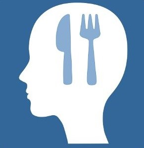
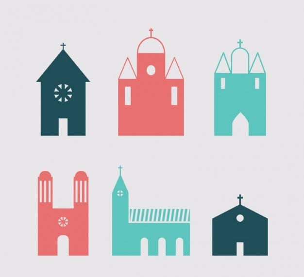

<!-- Main -->

<!-- One -->
<section id="one">
	

		<header class="major">
			<h2>Program and Organizational Design for Non-Profits, Foundations, and Government</h2>
		</header>
		
I work in teams to design program and organizational strategy for clients across the non-profit sector, including arts and culture, human services, health, and education. A few snapshots of my work can be found here.

	

</section>

<!-- Two -->
<section id="two" class="spotlights">
	<section>
		
		

			

				<header class="major">
					<h3>Supporting local artists and Boston's music scene</h3>
				</header>
				
Our client is young nonprofit organization that aims to build a vibrant, equitable music scene in Boston. They know that Boston-based artists need support overcoming barriers to make music. In this strategic planning process, our client wanted find out what artists’ needs are and which gaps our client as a nonprofit in the music industry is best positioned to fill.

				<ul class="actions">
					<li><a href="record.html" class="button">Learn more</a></li>
				</ul>
			

		

	</section>
	<section>
		
		

			

				<header class="major">
					<h3>Eating disorders services for underserved populations</h3>
				</header>
				
In the United States, 20 million women and 10 million men suffer from an eating disorder at some time in their life. Our client is an eating disorders organization that wants to better serve all people affected by eating disorders and be a proactive leader in the field. My team was tasked with designing programmatic and organizational strategy for our client’s next five years.

				<ul class="actions">
					<li><a href="eatingdisorders.html" class="button">Learn more</a></li>
				</ul>
			

		

	</section>
	<section>
		
		

			

				<header class="major">
					<h3>Vitality of Catholic parishes</h3>
				</header>
				
Catholic populations are aging, and many parishes across the nation are struggling to fill their pews. A regional Catholic diocese created a Task Force to study the spiritual, physical, and fiscal health of each parish to make recommendations to the Bishop that would ensure the viability of the diocese and vibrancy of Catholic life in the Church. My team was tasked with assessing the health of each parish and designing a comparative database tool to inform the Task Force’s decision making.

				<ul class="actions">
					<li><a href="catholic.html" class="button">Learn more</a></li>
				</ul>
			

		

	</section>
</section>

<!-- Three -->
<section id="three">
	

		<header class="major">
			<h2>Questions?</h2>
		</header>
		
These studies were conducted as part of my work as an Associate at TDC, a non-profit consulting firm in Boston. Client confidentiality is critical to my role, but if you'd like to discuss methodology or public-facing findings from any of the projects above, I'd be happy to talk.

		<ul class="actions">
			<li><a href="mailto:liu.carleen@gmail.com" class="button next">Contact Me</a></li>
		</ul>
	

</section>

