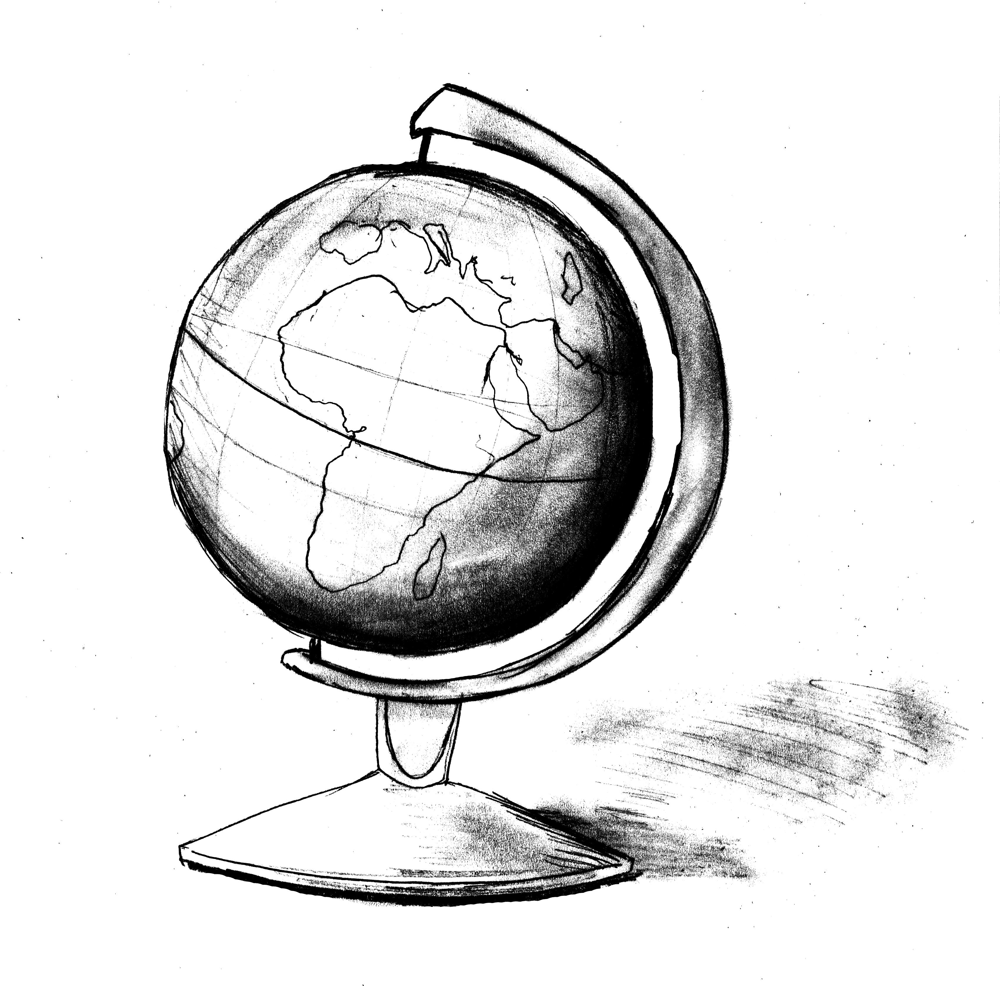
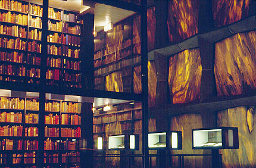

<!-- Main -->

<!-- One -->
<section id="one">
	

		<header class="major">
			<h2>essays, articles, and poetry</h2>
		</header>
		

	

</section>

<!-- Two -->
<section id="two" class="spotlights">
	<section>
		
		

			

				<header class="major">
					<h3>essay: <i>On Returning to a Home I've Never Been to</i></h3>
				</header>
				 
 Published in the March 11, 2016 issue of the <i>Yale Daily News.</i>

                
"In China, they teach you the geography of the country by telling you that it looks like a rooster. 'I don’t know what it’s called,' my middle school friend said, 'But my dad’s from the rooster’s butt!'"

				<ul class="actions">
					<li><a href="https://yaledailynews.com/blog/2016/03/11/liu-on-returning-to-a-home-ive-never-been-to/" class="button">Read more</a></li>
				</ul>
			

		

	</section>
	<section>
		
		

			

				<header class="major">
					<h3>op-ed: <i>Why Jordan doesn't have a Refugee "Problem"</i></h3>
				</header>
                
 Published in the December 2015 issue of <i>The Globalist.</i>

				
"We pass through three security checkpoints to enter Za’atari, the Syrian refugee camp ten kilometers east of Marfraq, Jordan. At each checkpoint, the walls are white and we wait until gates open reluctantly for our bus. There is one long road that stretches through the entire camp, and none of us can see the end of it."

				<ul class="actions">
					<li><a href="http://tyglobalist.org/in-the-magazine/theme/the-guests/" class="button">Read more</a></li>
				</ul>
			

		

	</section>
	<section>
		
		

			

				<header class="major">
					<h3>poem: <i>From Persephone</i></h3>
				</header>
                
 Published in September 2014 issue of <i>The New Journal.</i>   Signed copy preserved in the Beinecke Rare Book and Manuscript Library.

				
"I know the best mornings are made of 
                pancake batter, warm skin, loose stockings, 
                how to count tree rings, 
                the precise moment to  
                bite into a persimmon— 
                how to catch them 
                before they splatter onto the ground..."

				<ul class="actions">
					<li><a href="http://www.thenewjournalatyale.com/2014/09/from-persephone/" class="button">Read more</a></li>
				</ul>
			

		

	</section>
</section>

<section id="three">
	

		<header class="major">
			<h2>spoken word</h2>
		</header>
	

</section>

<section id="four" class="spotlights">
	<section>
		
		

			

				<header class="major">
					<h3><i>Thoughts in the Ocean During my Baptism</i></h3>
				</header>
				 
 Performed at the 2014 TEETH Slam Poets Fall Showcase.

                
"Let us dance in the ocean we could've easily drowned in as it begins to rain." 

				<ul class="actions">
					<li><a href="https://www.youtube.com/watch?v=TOZ4CBGRIqU" class="button">Watch</a></li>
				</ul>
			

		

	</section>

