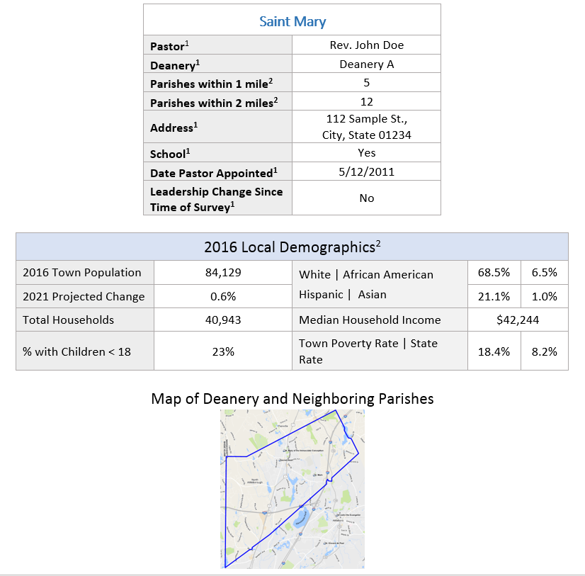
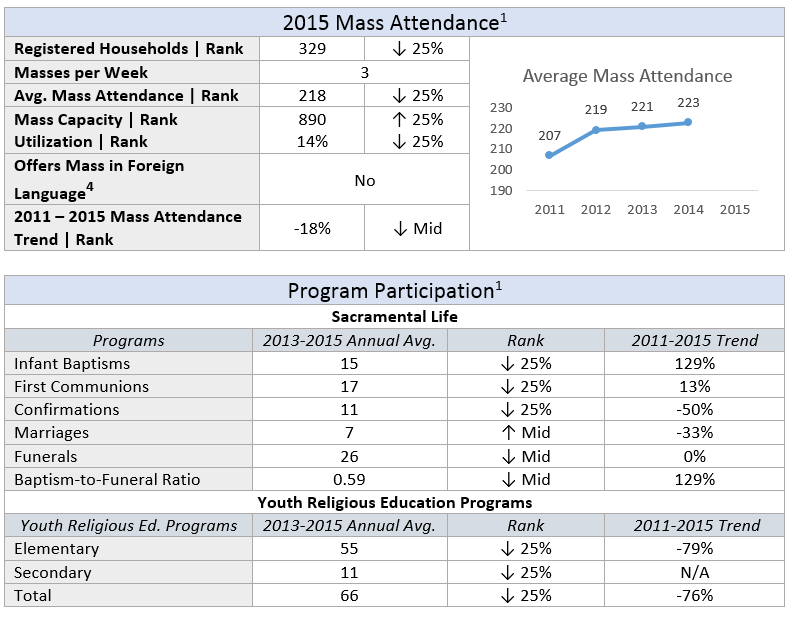

## Challenge

Catholic populations are aging, and many parishes across the nation are struggling to fill their pews. A regional Catholic diocese created a Task Force to study the spiritual, physical, and fiscal health of each parish to make recommendations to the Bishop that would ensure the viability of the diocese and vibrancy of Catholic life in the Church. My team was tasked with assessing the health of each parish and designing a comparative database tool to inform the Task Force’s decision making.

## Process
The parishioner survey and staff self-evaluation were based on the client’s established Criteria for Vibrant Parish.

### Parishioner Survey
>Parishioners across 82 parishes were surveyed on:
- Sacramental life
- Faith formation
- Community
- Serving those in need
- Administration

### Pastoral Staff Self-Evaluation
>Parish staff teams across 82 parishes were surveyed on the same key areas as parishioners to compare parishioner perspectives and self-perception. They were also surveyed on:
- Staff & leadership
- Finances
- Facilities

## Design Principles for Database
1.	Indicators of parish health mirror the client’s Criteria for a Vibrant Parish
2.	Usable for umbrella organization to **compare parishes at a macro level** and usable for parishes to **improve at an individual level**
3.	Usable for older population that is **less familiar with technology**

## Outcomes
I designed a profile for each individual parish that compiled data from various sources to provide an overall snapshot of each parish. 

>I aggregated key parish indicators into six distinct sections:
- Parish Overview
- Local Demographics
- Parish Participation
- Finances and Facilities
- Staff and Leadership
- Parishioner Survey and Pastoral Self-Evaluation Results (organized by key areas) 

*Note: Sample profile sections below are filled with fictional content for presentation purposes.
 

 
>Information included in these profiles was compiled from a variety of sources that include:
- Self reported data from the Presbyterate to the Diocese 
- Mission Insite
- Primary Research
    - Pastoral Self-Evaluation
    - Parishioner Survey

Each pastoral leader is now equipped with actionable information about their parish grounded in the context of the diocese and their community. I designed a detailed master database for the Task Force that is color-coded to allow for straightforward interpretation of data. These tools will inform practices and opportunities for merging for the diocese moving forward.

