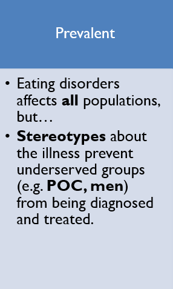
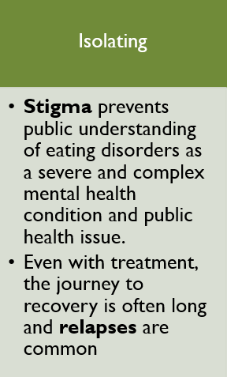
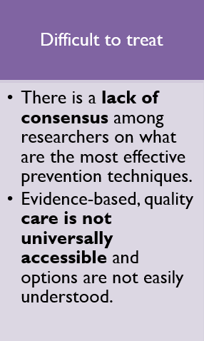
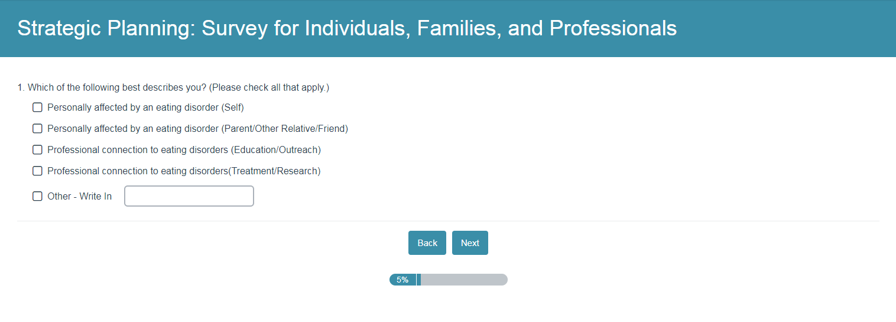
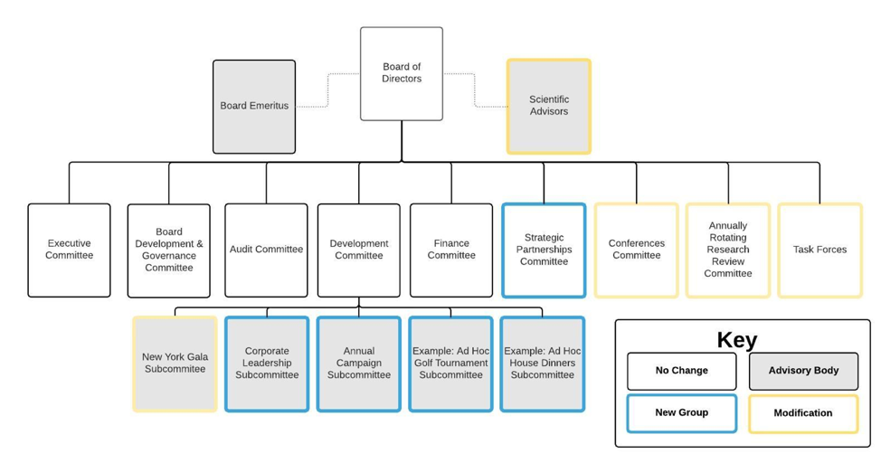

## Challenge

In the United States, 20 million women and 10 million men suffer from an eating disorder at some time in their life. Our client is an eating disorders organization that wants to better serve all people affected by eating disorders and be a proactive leader in the field. My team was tasked with designing programmatic and organizational strategy for our client’s next five years.  

## Process

### Interviews with Eating Disorder Professionals
> To evaluate the current state of the eating disorders field, we interviewed:
- Clinicians
- Researchers
- Leaders of local ED organizations
- Advocates

Eating disorders are: 

**Key finding #1**: There is a lack of centralized data, resources, and leadership in the eating disorders world.

### Survey 
> To better understand the needs of our client's constituents, we surveyed individuals, families & professionals about:
- Current programs 
- National conference
- Local engagement
- Demographics
- Access to treatment

**Key finding #2**: While our client has been successful in reaching young white women under the age of 35, it can expand its reach across age, race, gender, and socioeconomic status.

## Interviews with Organization's Staff

>To understand how the current governance and organizational struture is working, my team interviewed 
- Staff
- Board members
- Committee members

**Key finding #3**: Interviewees expressed desire for greater clarity on roles, responsibilities and ethics. They also wanted more consistent communication across committees.

## Design Principles
1.	Services should be **accessible to all** people affected by eating disorders across the US
2.	Impactful prevention and treatment **research** is catalyzed and disseminated
3.  Organizational structure encourages **broader demographic representation** among staff and **defined roles**, and **integrates scientific knowledge** into advisory bodies

## Prototyping and Testing

### Financial Model to Test Scenarios
We tested the financial impact of different scenarios in conference structure, research graning, local engagement, and partnerships.

### Redesigned Governance Structure

## Outcomes
My team conducted research and facilitated meetings with the Strategic Planning Committee and subcommittees to examine and set the strategy for the organization’s annual conference, research granting, local engagement and partnerships, advocacy efforts and governance. 

We worked closely with senior leadership to inform development and financial strategy, as well as organizational structure and hiring of key staff. The organization is now focusing on designing services for and expanding reach to underserved populations.
