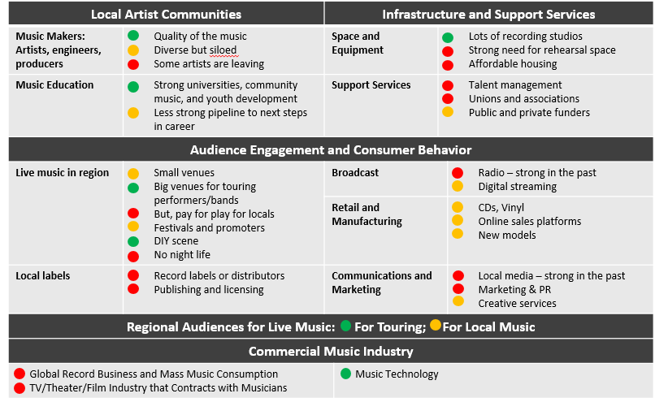
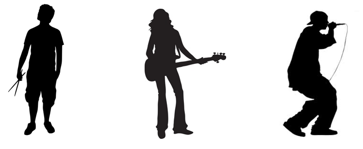
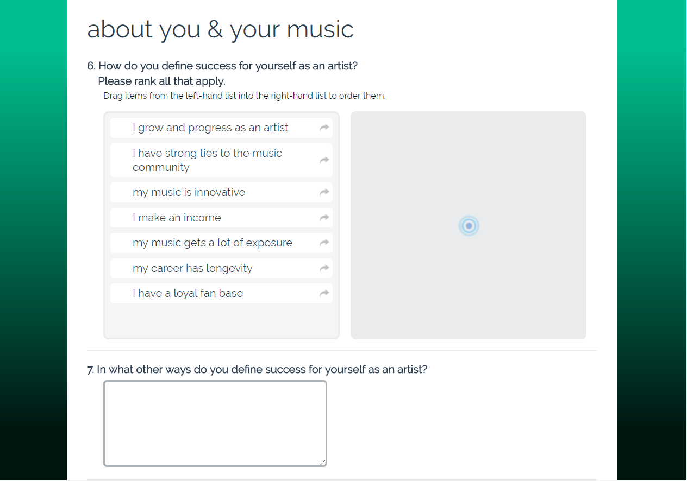
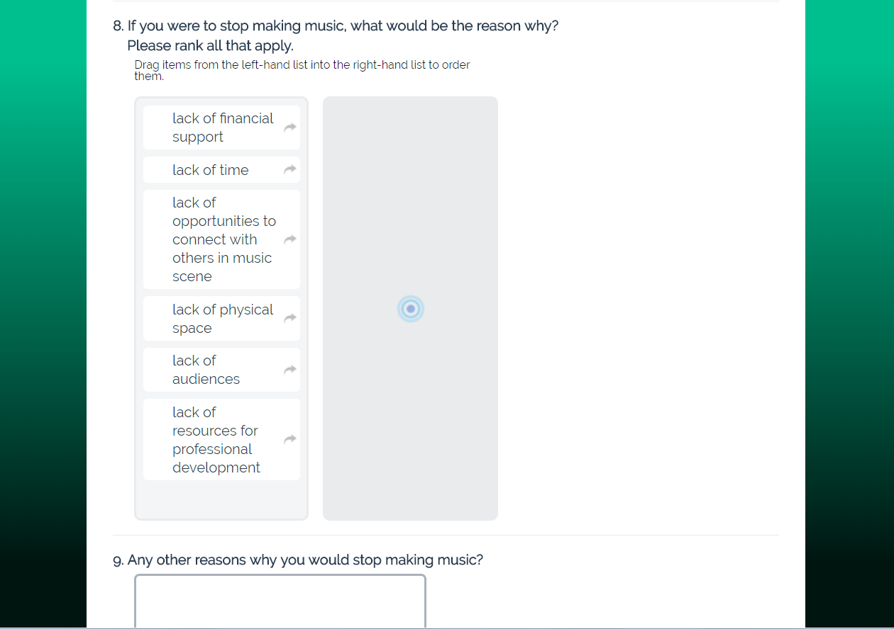

## Challenge

Our client is young nonprofit organization that aims to build a vibrant, equitable music scene in Boston. They know that Boston-based artists need support overcoming barriers to make music. In this strategic planning process, our client wanted find out what artists’ needs are and which gaps our client as a nonprofit in the music industry is best positioned to fill.
 
## Process

###  Interviews with External Stakeholders

> To learn more about artists’ needs, the Boston music scene, the music industry writ large, and the role non-profits can play, we interviewed:
- artists
- music industry professionals
- peer organizations in Boston
- benchmark organizations outside of Boston

My team put together a presentation of the interview findings for our client’s Strategic Planning Committee and some of the illustrations I created to facilitate discussion are below.

**Strengths and weaknesses of the Boston music scene**

 

**Iterating hypothesis on artist progression**

> Our initial hypothesis was that artists at different stages have different needs, and that artist progression is a funnel-shaped process – not everyone can move on to the next stage. The original goal was to identify artists who have the ability to progress professionally and support them in becoming self-sustaining artists who have a career in music.

In interviews, we found that artists pursued music in a variety of ways – a former full-time artist found more creative freedom and flexibility in pursuing music half-time after she had a child, another full-time artist created her own membership model for fans, and yet another artist had a full-time job unrelated to music because he felt *“[you’re] less apt to corrupt what you do if you don’t intend to make a living from it.”*

**Key insight #1:** While artist progression is a funnel-shaped process, there is flexibility in how artists can incorporate music in their lives, and this can change over time for an individual. There are other equally valid ways to engage in and contribute to the music community besides being a full-time artist.

 

**Key insight #2:** All artists have financial, space, development, and community needs. These needs may vary depending on whether artists are *emerging* artists who are just starting out, *“flex artists”* who pursue music but do not rely on it for their income, and *“career artists”* who aim to make a career from their original works.

## Artist Survey
I designed a ten-minute artist survey that consisted of both closed and open-ended questions. The goal was to learn about artists’ goals and barriers, so we can inform how our client can serve artists better and shape a collective vision about what Boston music could be.

**Artist Goals & Barriers**
> Our initial hypothesis was that making a living from music was a marker of success for artists. However, survey results and qualitative interview responses showed that this was not artists’ top priority.

 *“People are going to make music whether it’s funded or not, but I would be able to give 10 times more [to my music] if given the resources.”*

*“Every show has to be better than the last.”*

**Key insight #3:** While affordability is the primary barrier for most artists, making an income from music is not a primary goal for most artists. The primary goal is growth and progression as an artist.

## Design Principles
- All people should have access to making music.
- Music as a means of self-actualization.
- Nonprofits should not price existing music jobs out of the market.

## Prototyping and Testing
*In progress… to come!*