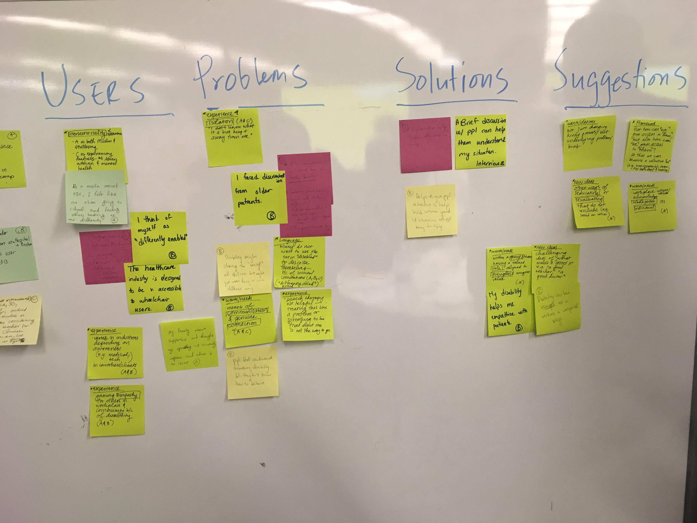
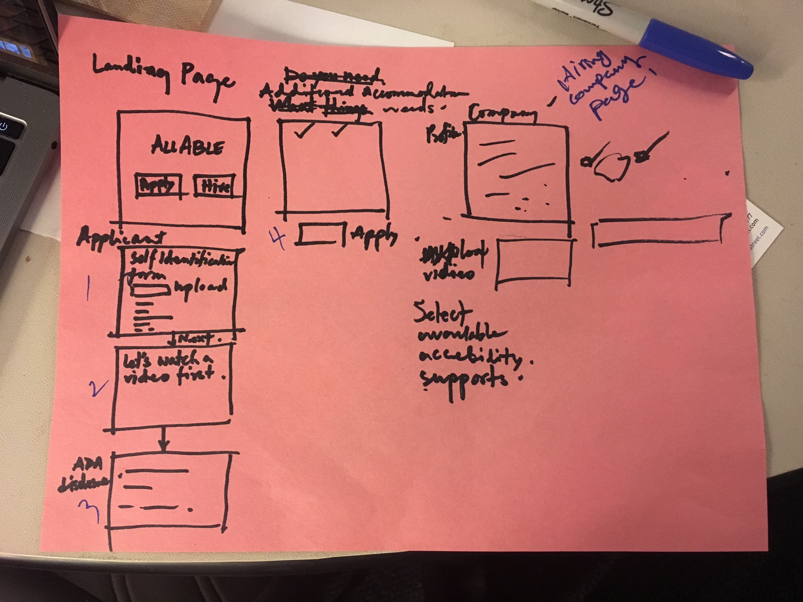
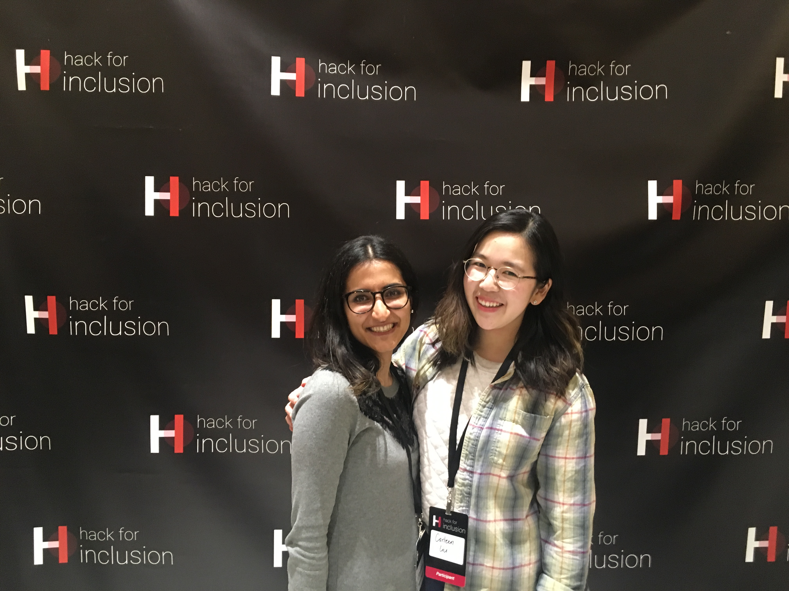

AllAble is a web platform for job seekers and employers that promotes accessibility in the hiring process and in onboarding. 

This project was created with my team at MIT Hack for Inclusion 2018. I facilitated my team's ideation and prototyping session. My team brought so many valuable perspectives, from HR practitioners who identify as having disabilities themselves to software engineers. Many people on my team were unfamiliar with design thinking tools and processes, so it was incredibly fun to dive in! Watch me give a three-minute pitch below.

<iframe width="854" height="480" src="https://www.youtube.com/embed/2NeBDJQnj5U" frameborder="0" allow="autoplay; encrypted-media" allowfullscreen></iframe>

Shout out to Fahad Punjwani and Lara Ortiz-Luis from the MIT Hack for Inclusion team for creating some great design thinking resources! If you'd like to use them for your own hacks for inclusion at your organization, check it out here.

<ul class="actions">
	<li><a href="https://drive.google.com/file/d/0B-XA0IN93ZilbVVDX3p2TGtCUDQ5OWNHbjNDamlJLU9aalNr/view?usp=sharing" class="button"> Design Thinking - Day 1 </a></li>
</ul>

<ul class="actions">
	<li><a href="https://drive.google.com/file/d/0B-XA0IN93ZilZklQMTh0OUpsNDdqQWVSTjM4MlZqT1Vsb3BZ/view?usp=sharing" class="button"> Design Thinking - Day 2 </a></li>
</ul>