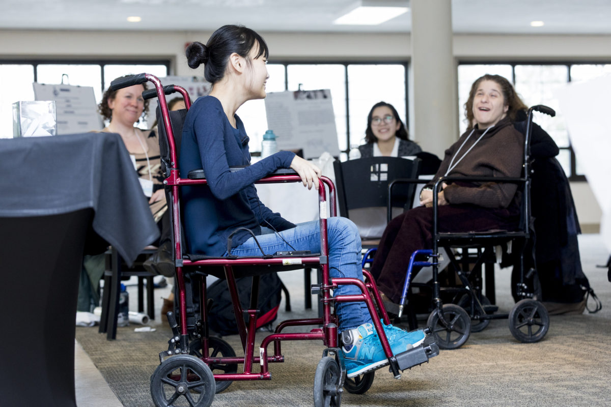

ELEPLATED is a personalized dining kit that makes dining more accessible and autonomous for people of all abilities, at home and in restaurants. 

This project was created with my team at Mount Ida College's Universal Design Symposium & Design-athon. We won the Judge's Choice Award for best design solution. Our user expert was Hope, who has cerebral palsy. We also had occupational therapists and Mount Ida's Director of Accessibility Services at the table. The designers on my team were interior designers, which was a new and important perspective for me to hear. We constructed a physical prototype and I created our pitch deck, which you can browse below.

<iframe src='https://onedrive.live.com/embed?cid=C0E8ACDB8A819984&resid=C0E8ACDB8A819984%21106&authkey=AKUG8Y4eSEQ0s8M&em=2&wdAr=1.3333333333333333' width='350px' height='286px' frameborder='0'>This is an embedded <a target='_blank' href='https://office.com'>Microsoft Office</a> presentation, powered by <a target='_blank' href='https://office.com/webapps'>Office Online</a>.</iframe>

The speaker this year was Melissa Shang, author of "Mia Lee is Wheeling Through Middle School." Shortly after this photo was taken, Hope told Melissa she was proud of her. Read more about Melissa's work as a youth disability advocate <a href="http://www.melissashang.com">here.</a>

