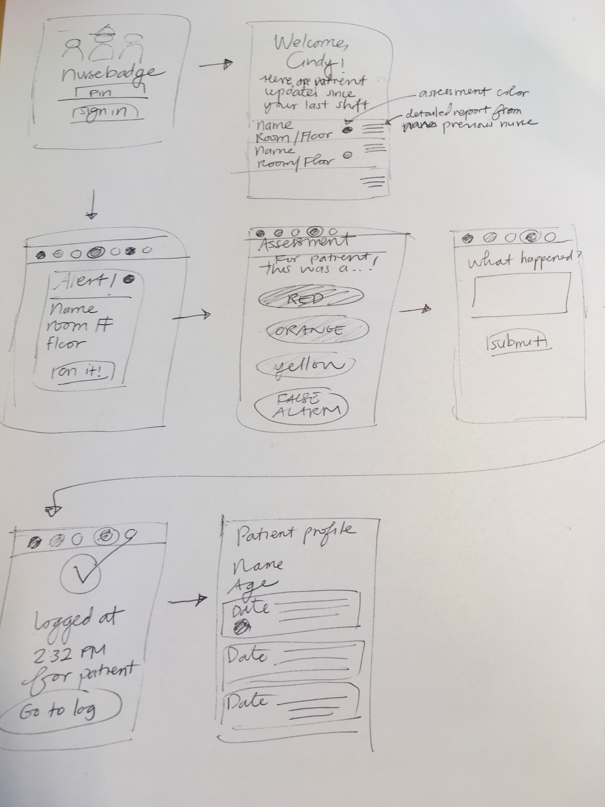

NurseBadge is a wearable that updates nurses with important patient events since their last shift, notifies them appropriately according to severity of the alarm, and facilitates communication with other nurses.

This project was created with my team at Computer Measurement Group's NeedforSpeed health hackathon. We won Best UX Pitch and Best Solution for Population and Patient Engagement. I came up with the idea, facilitated our ideation session, conducted a user interview over the phone with a nursing home nurse, partnered with our UI designer to create low fidelity wireframes, made the presentation and pitched our project.

<iframe src='https://onedrive.live.com/embed?cid=C0E8ACDB8A819984&resid=C0E8ACDB8A819984%21111&authkey=APIi0-garEbAHSc&em=2&wdAr=1.3333333333333333' width='722px' height='565px' frameborder='0'>This is an embedded <a target='_blank' href='https://office.com'>Microsoft Office</a> presentation, powered by <a target='_blank' href='https://office.com/webapps'>Office Online</a>.</iframe>

<iframe width="854" height="480" src="https://www.youtube.com/embed/ObSouTOguzM" frameborder="0" allow="autoplay; encrypted-media" allowfullscreen></iframe>
