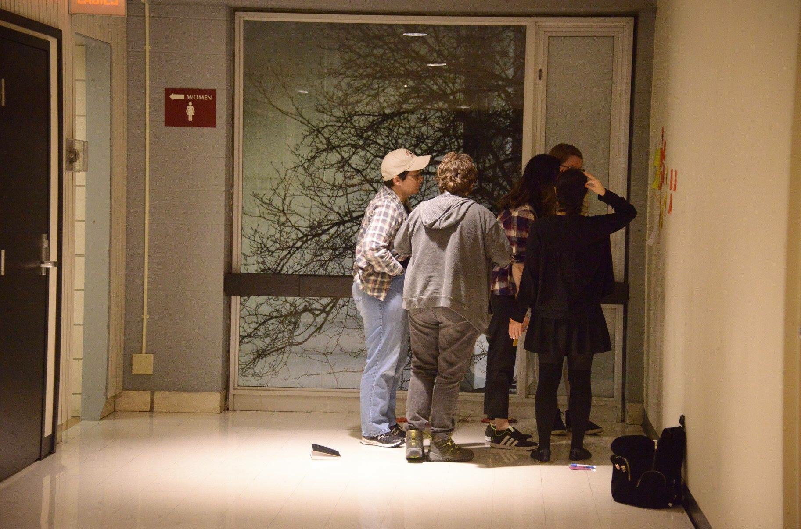

PuppyTime is a mobile website that enables folks to live video chat with shelter dogs and give them treats. This gives the dog more social time and builds a personal connection between the user and the dog to increase donations and adoption.

This project was created with my team at SheHacks Boston 2018. We won Most Entrepreneurial Hack sponsored by Rough Draft Ventures and Best Use of Amazon Web Services (AWS) sponsored by Major League Hacking. I helped structure our ideation session and did some pair programming on page styling. I will be conducting user testing in the coming months to refine our product.

<iframe width="854" height="480" src="https://www.youtube.com/embed/U1AZjLkwGs0" frameborder="0" allow="autoplay; encrypted-media" allowfullscreen></iframe>

Curious about the build? Check out more on our devpost <a href="https://devpost.com/software/puppytime"> here. </a>

